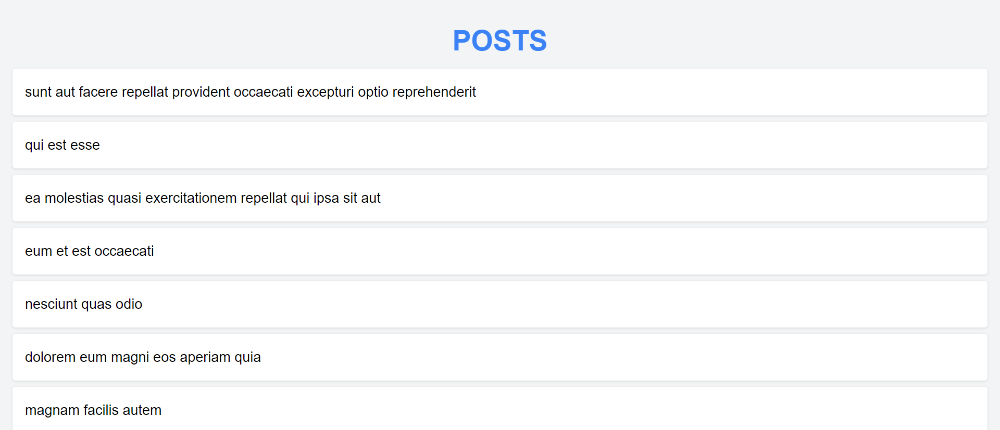
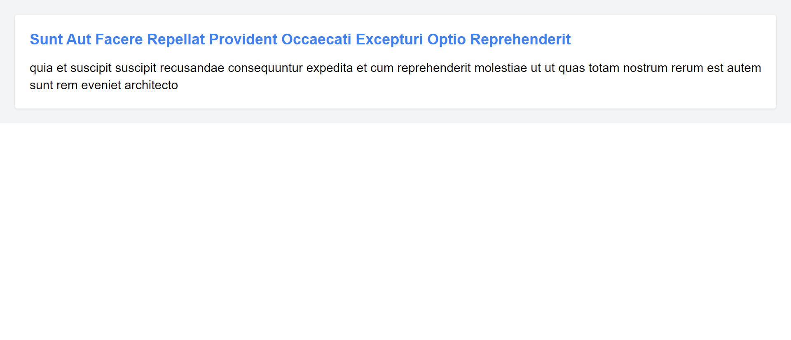

# Project Name

## Overview

This i the "Task 2: Interacting with REST API" (Bonus task), built using React JS and Tailwind CSS. This project interacts with the JSONPlaceholder API. The main functionality includes fetching and displaying posts from the API and allowing users to view detailed information about each post. The application is designed with a responsive layout using Tailwind CSS. React Router is implemented for navigation between the list of posts and individual post details, providing a seamless browsing experience.

## Technologies Used

- React JS
- Tailwind CSS
- Axios
- React Router

## Features

List of key features and functionalities:
- Fetching and displaying posts from an API
- Viewing detailed information of each post
- Responsive design with Tailwind CSS
- React Router for navigation between post list and detail view

## Project Structure

- **`public/`**: Contains public assets like the HTML file.
- **`src/`**: Contains the main codebase for the project.
  - **`components/`**: Contains React components such as `PostList`, `PostDetail`.
  - **`services/`**: Contains Axios setup such as `api`.
  - **`App.js`**: Main application component.
  - **`index.js`**: Entry point for the React application.
- **`package.json`**: Contains project metadata and dependencies.

## Screenshots

### Post List

### Post Details

## Technologies Used

- **React JS**: JavaScript library for building user interfaces.
- **Tailwind CSS**: Utility-first CSS framework for styling.
- **React Router**: React Router is a popular routing library for React applications, enabling declarative routing and navigation handling within single-page applications. 
- **Axios**: Axios is a JavaScript library used for making HTTP requests from browsers or Node.js applications, offering features like request and response interception, asynchronous request handling, and support for promises.
- **Vite**: Next-generation frontend tooling for development and build.

